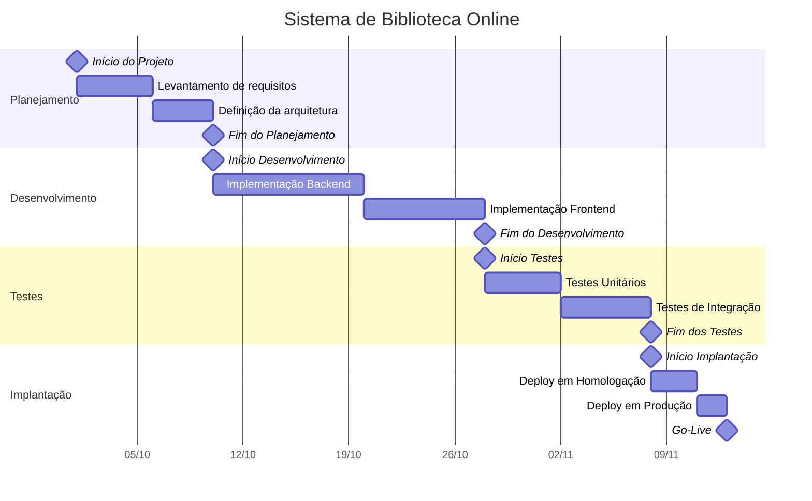

```mermaid
gantt
    title Sistema de Biblioteca Online
    dateFormat  YYYY-MM-DD
    axisFormat  %d/%m

    %% ============================
    %% PLANEJAMENTO
    %% ============================
    section Planejamento
    Início do Projeto               :milestone, m1, 2025-10-01, 0d
    Levantamento de requisitos      :a1, 2025-10-01, 5d
    Definição da arquitetura        :a2, after a1, 4d
    Fim do Planejamento             :milestone, m2, after a2, 0d

    %% ============================
    %% DESENVOLVIMENTO
    %% ============================
    section Desenvolvimento
    Início Desenvolvimento          :milestone, m3, after m2, 0d
    Implementação Backend           :b1, after m2, 10d
    Implementação Frontend          :b2, after b1, 8d
    Fim do Desenvolvimento          :milestone, m4, after b2, 0d

    %% ============================
    %% TESTES
    %% ============================
    section Testes
    Início Testes                   :milestone, m5, after m4, 0d
    Testes Unitários                :c1, after m4, 5d
    Testes de Integração            :c2, after c1, 6d
    Fim dos Testes                  :milestone, m6, after c2, 0d

    %% ============================
    %% IMPLANTAÇÃO
    %% ============================
    section Implantação
    Início Implantação              :milestone, m7, after m6, 0d
    Deploy em Homologação           :d1, after m6, 3d
    Deploy em Produção              :d2, after d1, 2d
    Go-Live                         :milestone, m8, after d2, 0d

```
